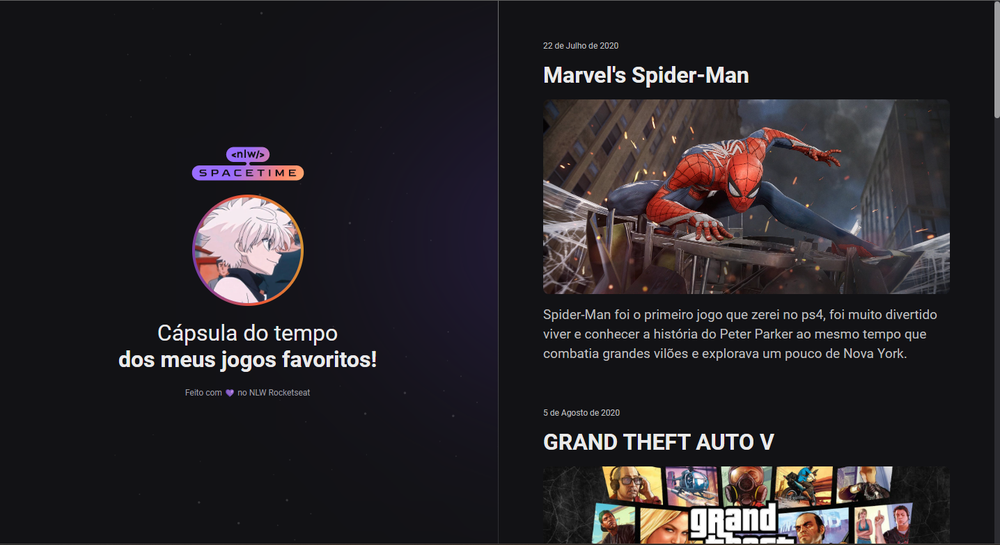

# NLW-spacetime

📌<a href="https://samuelvitor1.github.io/NLW-spacetime/" target="_blank">Site</a>

📝 Projeto feito durante a semana NLW-spacetime da rocketseat onde aprendi mais sobre conceitos de html, css, git e um pouco de figma também. Durante as aulas fui fazendo juntamente com o professor e no final modifiquei o tema para uma Cápsula do tempo dos meus jogos favoritos!

🖥️Tecnologias usadas

  
 
    
    
  

